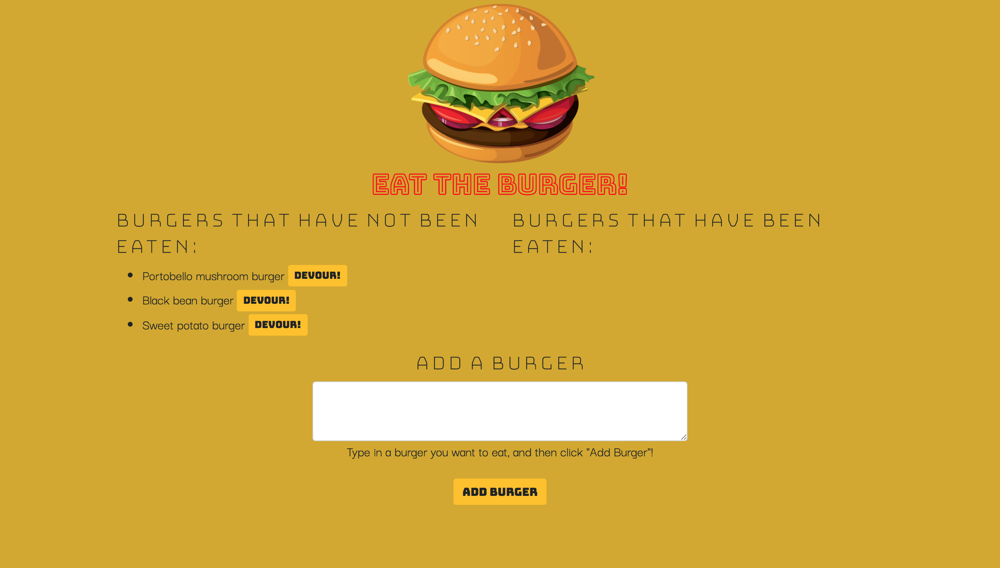

# Eat the Burger

* Eat the Burger is a restaurant app that lets users input the names of the burgers they'd like to eat. Whenever a user enters a name of a burger, the app displays the burger name on the left side of the page. Each burger in this list is paired with a "Devour" button—when the user clicks this button, the burger will be "eaten" and moved to the right side of the page.

* All burgers are stored in the database, whether devoured or not.

* This project uses MySQL, Express, Handlebars, ORM, JavaScript/jQuery, CSS, Bootstrap, and HTML.

